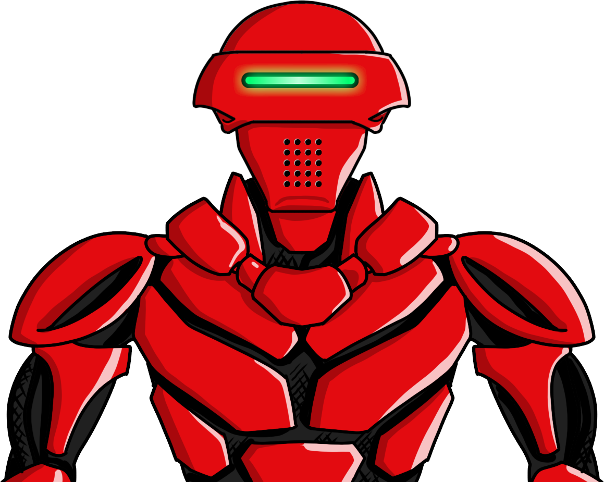

# XonaRobotics
XonaRobotics is a collectible NFT platform based on Ethereum blockchain with a limit of 1 million unique, randomly generated robots. 
<b>[Visit XonaRobotics](https://xonarobotics.com)</b>

 

<i>Smart contract address on Ethereum blockchain:</i> <b>[ADDR](https://etherscan.io/address/ADDR)</b>

<i>ABI:</i> [Link To File](./ABI)

This repository contains Solidity code for XonaRobotics NFT platform. It consists of ERC721 and other multiple dependencies. 
Take a visit to [xonarobotics.com](https://xonarobotics.com) to find out more about the futuristic crypto robots!

### Social

Follow us on [Twitter](https://twitter.com/LabsXona)
 
Get in touch on [Discord](https://discord.com/invite/C2xX8aFvhN)

